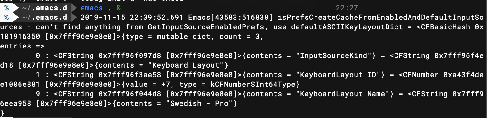

# Installation Martintosh

## Installed software

### Homebrew
```bash
/usr/bin/ruby -e "$(curl -fsSL https://raw.githubusercontent.com/Homebrew/install/master/install)")
```

### Macvim
```bash
brew cask install macvim
```
(Use cask to get app aswell.)

Run this to install plugins:
:PlugInstall

### Fish
```bash
brew install fish
sudo echo "/usr/local/bin/fish" >> /etc/shells
chsh -s /usr/local/bin/fish
```

### Oh my fish
```bash
curl -L https://get.oh-my.fish | fish
```

### Bob the fish (powerline theme for fish)
```bash
omf install bobthefish
brew install homebrew/cask-fonts/font-roboto-mono-for-powerline
```
### Tweaking
```bash
sudo echo "set -g theme_date_format \"+%H:%M\"" >> ~/.config/fish/config.fish
set -U theme_nerd_fonts no
set -Ux LSCOLORS gxfxbEaEBxxEhEhBaDaCaD
```

### Powerline font

```bash
brew install homebrew/cask-fonts/font-roboto-mono-for-powerline
```

### Emacs
```bash
brew tap railwaycat/emacsmacport
brew cask install emacs-mac
```
(Without cask this will compile and take some time. With cask installs the .app version.)

Emacs config:
M-x package-install: gruvbox-theme
M-x package-refresh-contents
M-x package-install: auto-complete
M-x package-install: helm
M-x package-install: multiple-cursors
M-x package-install: org-bullets


#### Keyboard error

This worked (i.e. added unicode input keyboard in system preferences):
https://stackoverflow.com/questions/53603246/strange-error-running-osascript-e-command-on-macos-mojave


### iTerm
```bash
brew cask install iterm2
```
iTerm works with 256 colors unlike terminal.
These themes might be an alternative since they should look good in 16 ANSI aswell:
https://github.com/nightsense/vimspectr

### Magnet
appstore

### Vimari
Vim bindings in safari.
https://apps.apple.com/us/app/vimari/id1480933944?ls=1&mt=12

### VSCode
```bash
brew cask install visual-studio-code
```

### Anki
```bash
brew cask install anki
```
- Fill in account and sync database from ankiweb.

## Preferences
### Keyboard shortcuts
- cmd-§: Switch to next window (System Preferences > Keyboard > Short commands > Keyboard > Move focus to next window)
- caps as ctrl (System Preferences > Keyboard > Keyboard > Special keys)
### Other
```bash
defaults write com.apple.dock autohide-time-modifier -float 0.15;killall Dock
```
- Show battery percent in menu bar.
- Activity monitor: show CPU history in dock icon.
- Show bluetooth in menu bar.
- Setup active corners. (Sleep screen lower-left, screen saver lower right.)
- Password needed immediately.
- Finder advanced settings:
    - show all file extensions.
    - search in this folder.

### Scroll reverser
https://pilotmoon.com/scrollreverser/

### Generate ssh key
```bash
ssh-keygen -t rsa -b 4096 -C "your_email@example.com"
```
Add it to github

### Mconfig
```bash
git clone git@github.com:martinclason/mconfig.git
cd mconfig
./install.sh
```

### Fonts
- Menlo for powerline


# Todo
- compile YCM
- se över vscode installation och config-filer
- installera latex
ddjsdjhjdHJHJ
